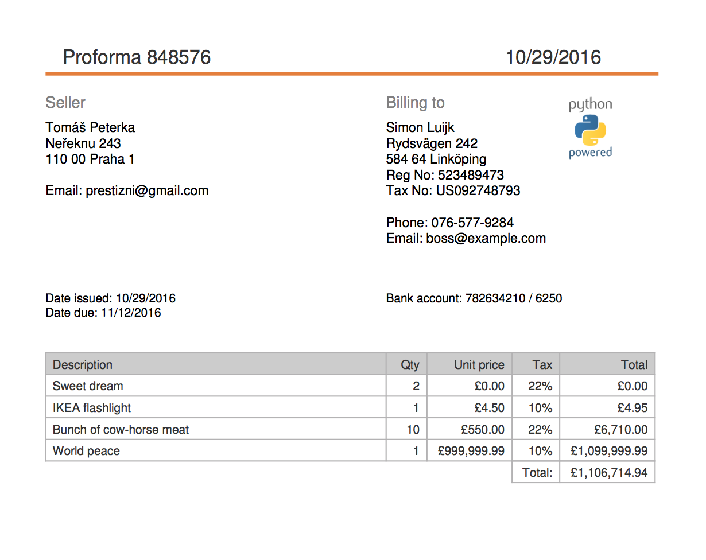

:author: Tomas Peterka & Simon Luijk

Django Invoice
==============

General purpose invoicing app.

This app provides simple (but sufficient) Invoice model with export abilities.
The default export is into PDF but it's easy to write and use your own. The app is
python 3 compatible, has full unicode fonts and ability to use company logo.

The model provides an option to use your own Address model via setting ``INVOICE_ADDRESS_MODEL``
and Bank Account model via ``INVOICE_BANK_ACCOUNT_MODEL``. Both settings the has to be a string
with full class name (e.g. "myproject.core.models.CompanyInformation").
The only rule for custom models is that it has to have a method ``as_text`` which returns unicode
string with newline separators `\n`. Addresses will be used as contractor and subscriber.

If BankAccount reference is presented then it will be rendered below contractor information with
*Variable symbol: {{ invoice.id }}*.

The invoice is intended to be referenced via foreign key from another model which handles
access policy and payments. These mechanisms are not provided in this app in favor of
generality.

Invoice has some interesting methods:

**invoice.as_bytes()** - returns bytes of rendered invoice

**invoice.as_response()** - returns HttpResponse with the invoice as an attachment

**invoice.as_file(basedir)** - saves the invoice into a file in basedir and returns absolute path to the file

**invoice.as_attachment()** - returns MIMEApplication usable in email ::

    email = EmailMessage(to=[email, ], subject="Invoice", text="Hello")
    email.attach(invoice.as_attachment())
    email.send()

Here we provide an example invoice generated from test

Localization
------------

I took one possible step to localization. That is usage of standard library ``locale``.
It uses your system's locale by default. To change this behaviour you need to set up
``settings.LANG`` to something like ``"cs_CZ.UTF-8"`` for Czech locale or ``"en_GB.UTF-8"``
for British locale.

The dates are different though! Because I wasn't able to make locale's formatting work I
rely on django's formatting through ``settings.SHORT_DATE_FORMAT``. Therefor if you want
different dates formatting this is the way to go.

Exports module
-------------

Provides export capabilities into ``html`` and ``pdf``. Export is selected in
``settings.py`` using ``INVOICE_EXPORT`` with hereto options ``"html"`` and ``"pdf"``.
You can submit your own ``Export`` implementation, then please use sting with
full-dotted path to your class as ``INVOICE_EXPORT`` value.

Module contains base class ``Export`` for overriding and ``HtmlExport`` which
is the default exporter.
There is ``PdfExport`` in ``exporters.pdf`` which needs reportlab fot its
functionality. Unfortunately the reportlab is not python3 compatible.
The exporter instance is stored as class attribute in ``Invoice.export``.
One can modify this attribute to substitute it's own exporter.
All Invoice's methods ``as_*`` will be functional the same. Here is a example ::

    from myproject import MyExporter

    order = MyOrder.objects.get(pk=1)
    order.invoice.export = MyExporter()

    email = EmailMessage(to=[email, ], subject="Invoice", text="Hello")
    email.attach(order.invoice.as_attachment())
    email.send()

TestApp
-------
We provide an example project. For running you need just ``django``, ``reportlab`` and ``Pillow`` installed.

There is currently only the admin interface which allows you to try to make your
own Invoices and export them via admin action. If you want to play with the
admin, don't forget to syncdb first.

You can run tests from this example app. You can run the test ::

    cd testapp/
    python manage.py test invoice

Changelog
=========

2017-01-30 version 1.0.2
------------------------

 - Changed settings.INVOICE_EXPORT_CLASS into settings.INVOICE_EXPORT and added shortcut options "html" and "pdf".
 - Added ``as_`` next to ``export_`` to be more intuitive
 - Added app_settings and swappable dependencies so migrations are user-friendly.

